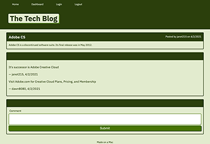

<h1 align="center">My Tech Blog 💻 </h1>

### 🏠 https://my-tech-blog-cr.herokuapp.com/

 
 

# Install

Open the above link in your browser.
 
 

# Usage

This is a blog site similar to Wordpress. A person can sign up, create posts and leave comments.

 
 

# Description

This app uses the Model-View-Controller architecture and it was created with Handlebars, mySQL, Sequelize, and Express Session NPM for authenication.
